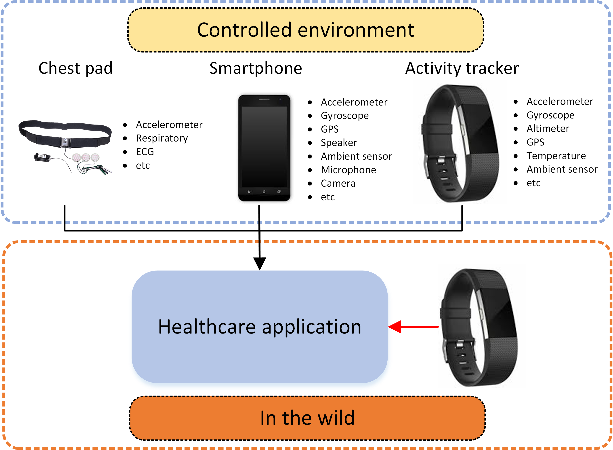

## More to Less (M2L): Enhanced Health Recognition in the Wild with Reduced Modality of Wearable Sensors


This is the  Pytorch implementation of  the paper `More to Less (M2L): Enhanced Health Recognition in the Wild with Reduced Modality of Wearable Sensors`

## Motivation.
* Wearable sensors are well suitable for continuous and ubiquitous monitoring of individual’s physiological and behavioral profiles in the free-living context (unobtrusive, affordable and user-friendly).
* Multiple sensors can provide different measurements of the subjects (i.e., chest pad, wrist wearable sensor, EEG sensors), and the different measurements usually contain complementary information, which is beneficial for healthcare applications.
* Therefore, fusing information from multiple sensors is a common choice in many applications


However, most works is built on the assumption: <mark> have access to an equal number of sensors in both training and testing</mark>

<p align="center">

<br><br>
<b>Figure 1.</b> Motivation.
</p>

* The assumption does not hold true in many  real-world scenarios due to various factors, i.e., `Device size/cost`, `Energy consumption constraint`, `Signal lost`, `User’s preference`, etc.
* Therefore, it is critical to bridge the gap between the models developed using multiple sensors during development and the models using less number of sensors during deployment in the wild.


## Requirements

- Python 3.7
- numpy
- Pytorch == 1.4.0 and later
- scikit_learn

## Folders

The code can be applied to other dataset as well, only if the data is organized by the required format.

* `./data`:  The required data files should be put into
* `./configs`:  place to modify the hyper-parameters used in the project
* `./experiments`: save the model's parameters and hyper-parameters into this folder.
* `./models`: model's definition
* `./utils`: utility functions


## Data

Right now the model is tested on both SMILE and TILES dataset.


## Usage
Commands for training and testing the model.

```bash
# provied the model name you'd like to use in the opts.py file.
python ./train.py
```

The detailed descriptions about the arguments are as following:

| Parameter name   | Description of parameter                                     |
| ---------------- | ------------------------------------------------------------ |
| DATA_PATH        | folder of the data file.                                     |
| MODEL_PATH       | folder to save model and other results.                      |
| CUDA_DEVICE      | the GPU device you want to use, otherwise, the model will be run on CPU |
| NUM_CLASS        | number of classes, for example 2 for binary classification (one-hot coding used) |
| BATCH_SIZE       | batch size                                                   |
| TRAINING_EPOCHES | how many epoches you'd like to use for the training          |
| LEARNING_RATE    | learning rate, i.e., 0.001                                   |
| DECAY_RATE       | adjust learning rate with training epoch, which is used with lr_scheduler. |
| STEP_SIZE        | adjust learning rate every STEP_SIZE by DECAY_RATE.          |
| INPUT_LEN        | Input sequence length of  (for example, 7 days)              |
| INPUT_DIM_M1     | dimension  of modality ONE                                   |
| INPUT_DIM_M2     | dimension  of modality TWO                                   |
| EMBED_DIM        | dimension of embeded size.                                   |


## <span id="resultslink">Results</span>

<p align="center">

<br><br>
</p>

<p align="center">

<br><br>
</p>


## Citation
If you use the code, please cite our work:
```bash
@inproceedings{yang2022more,
  title={More to Less (M2L): Enhanced Health Recognition in the Wild with Reduced Modality of Wearable Sensors},
  author={Yang, Huiyuan and Yu, Han and Sridhar, Kusha, etc },
  booktitle={2022 44st Annual International Conference of the IEEE Engineering in Medicine and Biology Society (EMBC)},
  year={2022},
  organization={IEEE}
}
```

